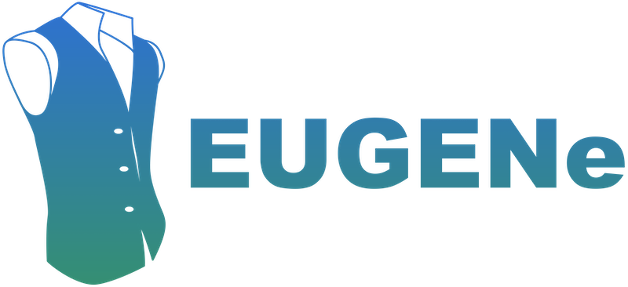

# Frequently asked questions (FAQs)

 - [I am new to DL for regulatory genomics. Where should I start?](#i-am-new-to-dl-for-regulatory-genomics-where-should-i-start)

 - [What is the difference between EUGENe and other DL frameworks?](#what-is-the-difference-between-eugene-and-other-dl-frameworks)

 - [What kind of data and tasks can I model with EUGENe](#what-kind-of-data-and-tasks-can-i-model-with-eugene)

 - [Can EUGENe be used to train models at base-pair resolution?](#can-eugene-be-used-to-train-models-at-base-pair-resolution)

 - [What are the memory requirements of EUGENe?](#what-are-the-memory-requirements-of-eugene)

 - [Does EUGENe only support PyTorch?](#does-eugene-only-support-pytorch)

- [Can I incorporate epigenetic tracks as input features in my model?](#can-i-incorporate-epigenetic-tracks-as-input-features-in-my-model)

 - [I am a power user when it comes to DL for regulatory genomics. Why would I use EUGENe?](#i-am-a-power-user-when-it-comes-to-dl-for-regulatory-genomics-why-would-i-use-eugene)

 - [How can I contribute to EUGENe?](#how-can-i-contribute-to-eugene)

 - [I am an industry researcher. Can I contribute to EUGENe?](#i-am-an-industry-researcher-can-i-contribute-to-eugene)

 - [What is the EUGENe logo supposed to be?](#what-is-the-eugene-logo-supposed-to-be)

## I am new to DL for regulatory genomics. Where should I start?
Welcome to the field! We recommend starting by installing EUGENe using these {doc}`instructions <installation>`. Once installed, check out the {doc}`basic usage tutorial <basic_usage_tutorial>` for an example of how to run an end-to-end EUGENe workflow. 

After you've worked through that, we recommend trying to train a model on a different dataset. Use this documentation as well as the [tutorials](https://github.com/ML4GLand/tutorials) and [use cases](https://github.com/ML4GLand/use_cases) to guide you through the process. 

Once your comfortable with the process, navigate to the [awesome-dl4g](https://github.com/ML4GLand/awesome-dl4g) repository for the latest resources and publications in the field and check out the "Open questions" section for ideas on projects. You can also post on the [GitHub Discussions](https://github.com/orgs/ML4GLand/discussions) page.

Join our Discord server to chat with other users and developers in the community. If you get stuck, feel free to open an issue on the EUGENe GitHub and we'll do our best to help you out.

## What is the difference between EUGENe and other DL frameworks?
We have found that most existing frameworks either only modestly reduce the complexity of the workflow or were heavily focused on one particular step in the workflow. We have also found that many of these tools were not designed to be used together. This is partially due to the low flexibility of the published methods to adapt to new data, which often requires a considerable engineering effort.

To put it succinctly, these tools do not fully meet the FAIR research software standards. We illustrate a few examples below:

 - [Kipoi](https://kipoi.org/) 
Kipoi is the go-to model repository in genomics. It is a a great tool for donwloading models and running inference, but provides limited functionality for data preprocessing, model training or model interpretation. We recommend using Kipoi in tandem with EUGENe. Train models in EUGENe and comparing them to models hosted by Kipoi. If your model performs well and is part of a publication, you can submit it to Kipoi for hosting.

 - [Selene](https://selene.flatironinstitute.org/master/index.html) 
Selene is a PyTorch-based deep learning library for sequence-level data. It offers dedicated functionality for training models and for variant effect prediction, but 

 - [Janggu](https://janggu.readthedocs.io/en/latest/readme.html) 
Janggu is a Python package that facilitates deep learning in the context of genomics. We would argue that Janngu is EUGENe's closest competitor when it comes to comprehensiveness in functionality, particularly when it comes to handling data. EUGENe’s data handling matches Janggu's core functionality, but also:

   1. is more flexible and interactive than Janggu. Janggu requires that many preprocessing decisions be made prior to loading data in (e.g. the order of the one-hot encoding, sequence bin size, resolution of coverage, etc.). SeqData can do these operations out-of-core (see below) within a notebook interface. This is especially useful for performing exploratory data analyses and for model interpretation (which is often done on smaller subsets of the data).
   2. aligns sequences, targets (e.g. read coverage) and metadata in a single object. This can be beneficial when applying the same transformations (e.g. simultaneous sequence and coverage trimming) to multiple variables and promotes a streamlined workflow.

The maintenance of the core data structures is handled by the large developmental teams of XArray, Dask and Zarr, all of which are NumFOCUS sponsored projects. As maintainers of SeqData, we can therefore focus on maintaining a smaller set of core functionality that utilizes these packages as they grow.

Designing software for DL for regulatory genomics is a substantial engineering challenge. It is a very fast advancing field with seemingly endless possibilities for how to engineer solutions. We believe that the best way to tackle this challenge is to build on top of the work of others. We have therefore designed EUGENe to be modular and composable, so that users can easily incorporate new tools and workflows as they are published. We also hope that this will encourage users to contribute their own tools and workflows to EUGENe.

## What kind of data and tasks can I model with EUGENe?
EUGENe is designed to be a general purpose tool for DL for regulatory genomics. A list of common regulatory genomics tasks that can be modeled end-to-end by EUGENe can be found at the {use-cases}`use cases <use_cases>` page.

In fact, we are not sure where the bounds are for what can be modeled with EUGENe just yet. Because xarray is so flexible, we can handle a wide variety of data types and formats if they can be read into xarray. Furthermore, since we are using PyTorch as a backend for our models, we can use any model architecture that can be implemented in PyTorch. This opens up the door for almost endless combinations of data types and model architectures to be tried out with EUGENe. This is what we did to generate the wrapper and helper functions currently built into the tool that allow for a streamlined analysis. And this is what we anticipate users will do to expand the functionality of EUGENe.

## Does EUGENe only support PyTorch?
As of now, this is mostly true. Data handling is framework agnostic (we worked hard to make it this way), so users can use SeqData to load data into models defined in other frameworks such as Tensorflow or JAX. However, pretty much anything that requires a model (training, evaluation and interpretation) is currently only supported for PyTorch. 

Our long-term goal for a framework such as EUGENe is for it to be framework agnostic. Stay tuned for updates on this front, but for now, see https://mlcontests.com/state-of-competitive-machine-learning-2022/?utm_source=substack&utm_medium=email#winning-toolkit under “No competition for PyTorch subheading” for a good summary of why we chose PyTorch as our starting backend framework.

## Can EUGENe be used to train models at base-pair resolution?
Yes! SeqData by default reads coverage at base-pair resolution and we have recently added BPNet as a "built-in" model architecture that has been shown to work well at base-pair resolution. We are also working on adding more base-pair resolution models to the library and adapting downstream analyses (such as attribution analysis) to work with BPNet (if you just predict the profile they will work fine). See the [BPNet use case](https://github.com/ML4GLand/use_cases/tree/main/BPNet) for an example of how to train a BPNet model with EUGENe.

## What are the memory requirements of EUGENe?
As of the 1.0.0 release, EUGENe can now be used for completely out-of-core training. EUGENe’s effective memory limitation is the memory required to load in a single sequence. That is, as long as a single sequence can fit into both a user’s CPU and GPU RAM, a EUGENe model can be trained on that dataset (in this case with a batch size of 1). In practice, training usually occurs in larger batches, but the principle remains the same.

## Can I incorporate epigenetic tracks as input features in my model?
Yes! EUGENe does not currently have any built-in models that support epigenetic tracks as input features, but it is possible to incorporate them into your own custom models. SeqData can easily read in epigenetic tracks from a variety of file formats and convert them into a PyTorch dataloader.

## I am a power user when it comes to DL for regulatory genomics. Why would I use EUGENe?
Thanks for checking out EUGENe. We recognize that users may already have their favorite tool or library (or just don't use PyTorch!). Advanced users may nonetheless find many aspects of EUGENe useful even if they prefer to build their workflows from the existing tools in this space. EUGENe was built in a modular manner, and can therefore be seen as another tool in the toolkit, much like captum or logomaker say, where a user can take advantage of the parts they want and ignore the parts they don’t. 

For instance, a machine learning scientist might be familiar with captum and its usage, but have never worked with a BigWig file before. Such a user could use EUGENe (or just SeqData on its own) to load and preprocess their dataset, and then decide to train, evaluate and interpret the model with other packages or their own bespoke code. EUGENe can also help advanced users reduce repetitive tasks (e.g. boilerplate architecture definitions, training loops, attribution analysis, etc.) and mitigate errors in bespoke implementations.

Most importantly, we also believe that advanced users can help us further develop EUGENe's functionality by adding more complex workflows and tools, making them more broadly accessible. This is job for more than a handful of people, and we welcome contributions from the community to help us expand EUGENe's functionality. We envision that this list will grow as the field of regulatory genomics continues to develop and new DL solutions are published.

## How can I contribute to EUGENe?
Check out the {doc}`contributor's guide <contributing>` for more information on how to contribute to EUGENe. We welcome contributions such as bug reports, bug fixes, documentation improvements, enhancement suggestions, and other ideas! 

## I am an industry researcher. Can I contribute to EUGENe?
Yes! We hope that EUGENe will grow into a community project that can let you build a network that lasts across jobs and roles. Lifelong employment at a corporation is less and less common. Joining our community will let you build bonds that cross jobs and could help you do your job today better too!

## What is the EUGENe logo supposed to be?

Obviously the most important FAQ should be saved for last. The logo is a reference to the character [Eugene Fitzherbert](https://www.youtube.com/watch?v=P1IHKm7yolM) from the Disney movie [Tangled](https://www.google.com/search?q=tangled&tbm=isch&sa=X&ved=2ahUKEwiip4i555iAAxWqIUQIHb9QBlcQ0pQJegQIDxAB&biw=1728&bih=1000&dpr=2). The logo is a stylized version of the character's [trademark vest](https://www.google.com/search?q=eugene+fitzherberts+vest&tbm=isch&ved=2ahUKEwjqvOLF55iAAxXyNkQIHY9eAwgQ2-cCegQIABAA&oq=eugene+fitzherberts+vest&gs_lcp=CgNpbWcQAzoKCAAQigUQsQMQQzoFCAAQgAQ6BwgAEIoFEENQ7wRYvQpgiQtoAHAAeACAAUCIAZUDkgEBN5gBAKABAaoBC2d3cy13aXotaW1nwAEB&sclient=img&ei=kc-2ZKqwCfLtkPIPj72NQA&bih=1000&biw=1728), designed by the wonderful [Michelle Franc-Ragsac](https://www.mragsac.com/) formerly of Bioinformatics and Systems Biology program fame at UC San Diego.

We thought this was a fitting analogy for EUGENe, a bioinformatics tool with a good heart and trying to find its place in the world of DL for regulatory genomics.

David Kelley has his kennel of models, Jacob Schreiber has his orchard of models and tools. Dibs on Disney characters for the EUGENe team.
