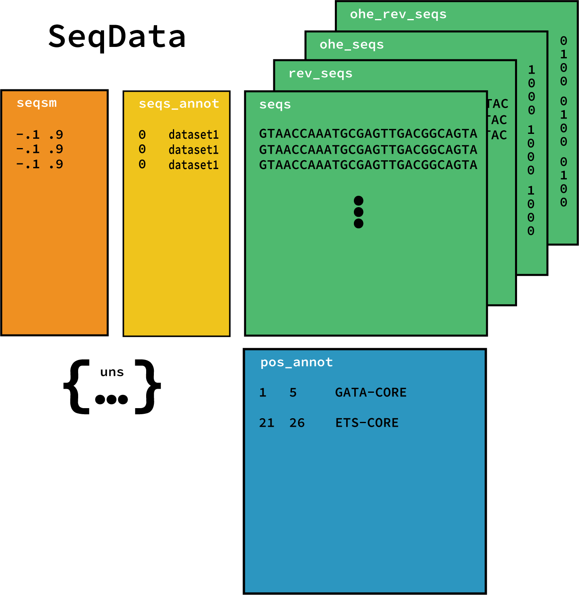

SeqData
==================================

.. autoclass:: eugene.dataloading.dataloaders.SeqData

Usage
----------------------------------
The SeqData object is essential to the EUGENe workflow, quickly allowing for easy storage and manipulation of a dataset.

Figures
----------------------------------
