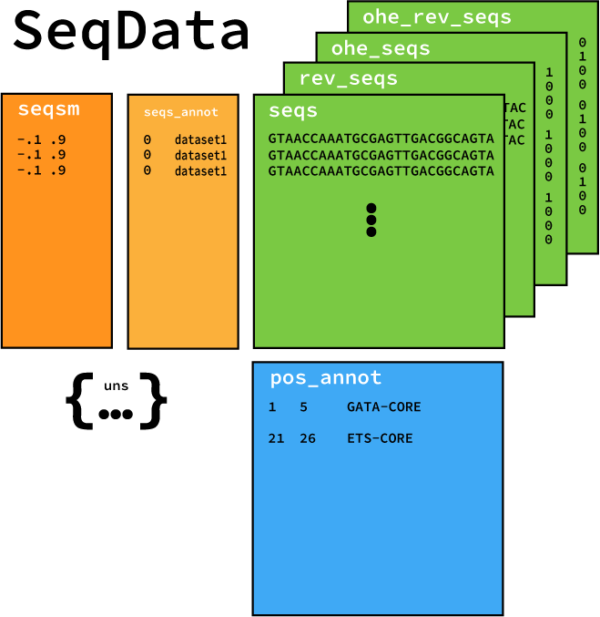

# Module Usage Principles

This page is dedicated to giving users a deep dive into the modules that make up EUGENe and usage principles for each one. We will first describe the worklow of EUGENe, then go into the details of the main EUGENe objects, and finish by discussing each module individually

## Workflow

A EUGENe workflow consists of three major steps that themselves can be broken down into several substeps. These major steps are:

1. Extract, load and transform (ETL) datasets for deep learning
2. Instantiate, initialize and train (IIT) deep learning models with PyTorch Lightning
3. Evaluate and interpret (EI) trained models with a variety of methods and visualizations

## EUGENe Objects
To execute these workflows, our current release relies on two main custom Python objects: ``SeqData`` and `BaseModel`. These objects are described in more detail below.

### `SeqData`

#### What is `SeqData`?

`SeqData` objects are the core data containers of EUGENe. `SeqData` is a Pythonic data structure that is modeled after AnnData [^cite_Virshup21] and is meant to containerize and simplify a EUGENe analysis workflow. `SeqData` objects are responsible for holding all the information in a dataset. The following schematic is meant to represent a `SeqData` object:

<figure>
<p align="center">

<figcaption align = "center"><b>SeqData schematic showing attributes and their alignments</b></figcaption>
</p>
</figure>

##### Sequence representations (`seqs`, `rev_seqs`, `ohe_seqs`, `rev_ohe_seqs` and `seqsm`)
The primary data contained in a `SeqData` object are sequence representations. All sequence representations should be aligned along the axis of the number of sequences in the dataset. (the y-axis dimension in the schematic above)

To genomics researchers, the most convenient way to encode these sequences is as strings of the alphabets “ACGT” and “ACGU” for DNA and RNA respectively. These are stored in the `seqs` attribute of the `SeqData` object as a Numpy ndarray of type object. The `seqs` attribute is meant to hold the 5’ to 3’ direction of nucleotide  sequences, but it is often useful to consider the 5’ to 3’ direction in some manner when training models. The `rev_seqs` attribute of `SeqData` is meant to hold the reverse complement string representation of the sequences.

Having these strings representations readily available in a programmatic setting is useful for plotting functions, but statistical models of the data require numerical inputs. The most widely used numerical representation of DNA sequence is the one-hot encoding, where each base of the respective alphabet is reserved a position along a 4-dimensional vector, with A in the first position, C in the second and so on. The `ohe_seqs` attribute is designed to hold these 4 x L length arrays as Numpy ndarrays, and the `ohe_rev_seqs` holds the one hot representation of the reverse complement.

```{note}
By defauly EUGENe expects the first dimension of all one-hot encoded sequences to be the number of channels (in the case of the nucleotide alphabets, 4) and the second dimension to be the length of the sequence. This is the convention used by PyTorch and PyTorch Lightning for 1D convolutions.
```

In many cases, we also have *a priori* knowledge of the sequence features contained within a sequence (e.g. the location of potential transcription factor binding motifs). In these situations, it can often be beneficial to encode the sequences in manners other than a one-hot encoding. Because we often lose the positional alignment of sequences when encoding in these ways, multidimensional encodings of a given sequence have a home in the `seqsm` attribute of `SeqData`. These also include dimensionality reduction transformations of sequences. Like the other attributes of this section, `seqsm` should always maintain alignment with the number of sequences dimension of the dataset.

##### Sequence annotations (`seqs_annot`)
The other piece of data of fundamental importance to almost all EUGENe workflows are per sequence metadata. These are often the targets that we wish to predict in a supervised learning setting, but can also represent important variables used for visualizations, preprocessing or dataset splitting. The `seqs_annot` attribute of `SeqData` is meant to hold any annotations that are per sequence, and is implemented as a `pandas DataFrame`.

##### Positional annotations (`pos_annot`)
We have also included an attribute along the positional axis of a sequence dataset, namely `pos_annot`. These positional annotations are implemented as a [`PyRanges`]() object that has built functions for many genomic range utilities like merging and subtraction. This object can also easily function as a `pandas DataFrame` and is meant to contain any kind of positional annotations for sequences. In its current implementation, it functions as a in memory bed file for the sequences and does not currently align along the positional axis (the x-axis dimension in the schematic above).

##### Unstructured data (`uns`)
For all unstructured data that does not align or annotate sequences or positions, we have implemented the uns attribute as a an ordered Python dictionary. This is the default home of position frequency matrices, feature attributions, dataset transformation objects and any other data you generate on your sequences and don't really know what to do with.

#### How is `SeqData` stored on disk?
```{note}
Be careful when trying to save SeqData after adding data to the uns attribute. See
```

#### What else can I do with SeqData?
For a more practical understanding of working with SeqData objects, we recommend checking out [our dedicated tutorial]() to the object.

```{note}
An important concept we want to note up front. You are not required to use a `SeqData` object in EUGENe. You can execute most of the core functionality in EUGENe without touching a ``SeqData`` object. However, we strongly recommend that you use a ``SeqData`` object, as it will make your life much easier.
```

### BaseModel

The BaseModel class in EUGENe is the scaffold upon which all models are built. BaseModel is the class that all new and built-in model files must be inherited from in order to fully take advantage of all of EUGENe's functionality.

EUGENe offers several customizable architectures as built-in, including flexible fully connected, convolutional, recurrent, hybrid architectures and seminal DeepBind and DeepSEA architectures. We also provide implementations of models introduced in Jores et al and Kopp et al. However, this set of provided modules may not be sufficient for a users training task and many users may need to add custom architectures to the library.

We next will describe details and usage principles for each module in EUGENe. We find it easiest to think of these modules in the context of the three stage deep learning workflow described above.

## Extract, Transform, Load (ETL)

### `datasets` -- Quickly start your development or benchmarking

Every bioinformatician knows the pain of trying to track down and format a dataset for their needs. This module is meant to ease that burden. It also sets up users to run quick benchmarks of methods and ideas on! We designed the datasets module with the following principles in mind:

    1. A file containing a list of datasets and their descriptions is kept in `datasets.csv` that can be accessed with the `eu.dl.get_dataset_info()` function. You can also check out the [datasets] API for a list of currently available datasets and their descriptions.

    2. Datasets are returned to users as SeqData objects with simple calls (e.g. eu.datasets.dataset_name()).

    3. If the user does not have the dataset downloaded in the location specified by the command, EUGENe works to download it for you

    4. EUGENe isntallations come with a single preloaded dataset (random1000) representing random sequences. These are designed for testing purposes

    5. Adding datasets is a pretty straightforward process and we encourage users to do so and submit pull requests for them!


### `dataload` -- Read/write data from many common file formats
This module is designed to handle both the loading of data into Python objects and the compilation of those objects into dataloaders for neural network training.

    1. We want to be able to generalizably load data from csv, numpy, fasta, and h5sd (see below) into a SeqData object (see below).

    2. SeqData objects are the core data containers of EUGENe.

    3. We need to be able to fluidly go between SeqData and PyTorch datasets and DataLoaders

    4. Normally, SeqData objects should be saved as h5sd files

    5. We wrap Janggu functions for reading from bed, bigWig, and bam

### `preprocess` -- Prepare data for sequence-based deep learning
This module is designed to let users interact and modify SeqData objects to prepare for model training and to allow for more in depth analysis

    1. There are several classes of preprocessing functions that act on more familiar objects. Ideally, these functions are agnostic of SeqData
    2. Sequence preprocessing (eu.pp.*_seq() and eu.pp.*_seqs()) functions act on sequence. Ideally, each type of function (reverse complement, one-hot encode etc.) should have a single sequence function and a multiple sequence function.
    3. Ideally, each multiple sequence function should be parallelizable (or vectorized) and should not just loop through the sequence.
    4. Dataset preprocessing functions are meant to serve as helpers to perform the more “traditional” machine learning preprocessing steps (e.g. train/test split, feature standardization etc.)
    5. All preprocess functions should have SeqData wrappers (eu.pp.*_seq_sdata())
    6. By default, SeqData objects are modified in place, but if copy = True is specified a copy is returned
    7. Adding a preprocessing function is a simple process. See the contribution guidelines(WIP)

## Instantiate, Initialize, Train (IIT)

### `models` -- Instantiate and initialize neural network architectures
This module is designed to allow users to easily build and initialize several neural network architectures that are designed for biological sequences.
    1. Fundamentally, a model needs to be a PyTorch module with the init and forward functions implemented
    2. Every model should extend the BaseModel class that is implemented in the _base_model.py file.
    3. By default we assume a single stranded (ss), regression model (regression) that is trained to optimize mean squared error (mse)
    4. We specify three main classes of model: base_model, sota_model, and custom_model
    5. Each model is built from a combination of modules and standard PT code
    6. Models are either instantiated through calls to eu.models.ModelName() constructors or through config files
    7. After model instantiation, users can edit things like optimizers, loss functions etc. But cannot edit model architecture!
    8. Advanced training...

### `train`
For basic trianing, this module is mainly a wrapper around [PyTorch Lightning's trainers](). In future versions, we will add more advanced training functionality for doing things like hyperparameter optimization, GAN training, and more.
    1. Logging is handled by PyTorch Lightning via the Tensorboard logger
    2. Metric tracking is handled by TorchMetrics
    3. Loss functions are passed into the model
    4. Optimizers are passed into the model
    5. Learning rate schedulers are passed into the model

## Evaluate and Interpret (EI)

### `evaluate`
Similarly to training, this module is mainly a wrapper around [PyTorch Lightning's trainers](). However, we also added a metrics library to help users calculate training metrics on their SeqData objects
    1. Predictions on a SeqData are saved in `seqs_annot` attribute and to disk by default (with column names and file paths specified by the user)
    2. Metrics are calculated on the SeqData object...

### `interpret`
There is no shortage of ways one could come up with to try to interpret a trained model. We have included three core intepretation categories in EUGENe with many more to come
    1. Visualize filters as PWMs with
    2. Calculate per nucleotide importance scores with
    3. Use the model as an in silico oracle to predict the effect of mutations and other perturbations with

### `plot`
This module is meant to

## `utils` -- Miscellaneous utilities
This module is designed to be a catch all for functions that don't fit into the other modules. This includes functions for things like plotting, saving/loading models, and more.
