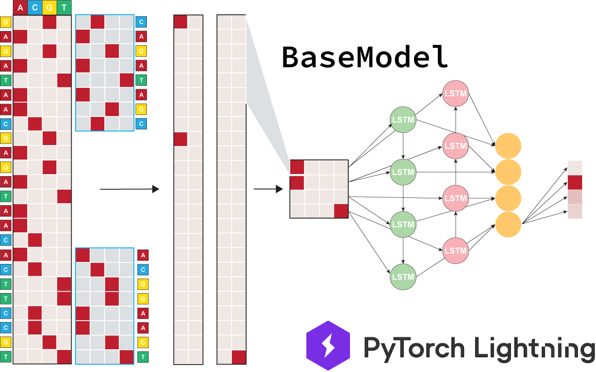

# Module Usage Principles
This page is dedicated to giving users a deep dive into the modules that make up EUGENe and usage principles for each one. We will first briefly describe the workflow of EUGENe (practically illustrated in the {doc}`basic usage worfklow <basic_usage_tutorial>` tutorial), then go into the details of the main EUGENe objects, and finish by discussing each module individually.

## Workflow
A EUGENe workflow consists of three major stages that themselves can be broken down into several substeps. These are:

1. Extract, transform and load (ETL) datasets for deep learning
2. Instantiate, initialize and train (IIT) deep learning models with PyTorch Lightning
3. Evaluate and interpret (EI) trained models with a variety of methods and visualizations

## EUGENe Objects
Our current release relies on two main custom Python objects: `SeqData` and `BaseModel`.

### `SeqData` -- An AnnData-like container for sequence data

#### What is `SeqData`?
`SeqData` objects are the core data containers of EUGENe. `SeqData` is a data structure that is modeled after [AnnData](https://anndata.readthedocs.io/en/latest/) and is meant to containerize and simplify a EUGENe analysis workflow. `SeqData` objects are responsible for holding all the information for a given dataset. Credit again to AnnData for many of the concepts behind `SeqData` and for the following image conceptualization:

<figure>
<p align="center">

<figcaption align = "center"><b>SeqData schematic showing attributes and their alignments</b></figcaption>
</p>
</figure>

##### Sequence representations (`seqs`, `rev_seqs`, `ohe_seqs`, `rev_ohe_seqs` and `seqsm`)
The primary data contained in a `SeqData` object are sequence representations. All sequence representations should be aligned along the axis of the number of sequences in the dataset (the y-axis dimension in the schematic above).

To many genomics researchers, the most convenient way to encode these sequences is as strings of the alphabets “ACGT” and “ACGU” for DNA and RNA respectively. These are stored in the `seqs` attribute of the `SeqData` object as a [Numpy ndarray](https://numpy.org/doc/stable/reference/generated/numpy.ndarray.html). The `seqs` attribute is meant to hold the 5’ to 3’ direction of nucleotide sequences, but it is often useful to consider the 3’ to 5’ direction in some manner when training models. The `rev_seqs` attribute of `SeqData` is meant to hold the reverse complement string representation of the sequences.

These string representations are mostly useful for plotting, but cannot be directly used by deep learning models. The most widely used numerical representation of DNA sequence is the one-hot encoding, where each base of the respective alphabet is reserved a position along a 4-dimensional vector, with A in the first position, C in the second and so on. The `ohe_seqs` attribute is designed to hold these 4 x L length arrays as Numpy ndarrays, and the `ohe_rev_seqs` holds the one-hot representation of the reverse complement.

```{note}
By default EUGENe expects the first dimension of all one-hot encoded sequences to be the number of channels (in the case of the nucleotide alphabets, 4) and the second dimension to be the length of the sequence. This is the convention used by PyTorch and PyTorch Lightning for 1D convolutions.
```

In many cases, we also have *a priori* knowledge of the sequence features contained within a sequence (e.g. the location of potential transcription factor binding motifs). In these situations, it can often be beneficial to encode the sequences in manners other than a one-hot encoding. Other encodings of a given sequence have a home in the `seqsm` attribute of `SeqData`. These can include dimensionality reduction transformations of sequences or other handcrafted encodings (e.g. presence/absence of TF binding sites). Like the other attributes of this section, `seqsm` should always maintain alignment with the number of sequences dimension of the dataset.

##### Sequence annotations (`seqs_annot`)
The other piece of data of fundamental importance to almost all EUGENe workflows is per sequence metadata. These variables are often the targets that we wish to predict in a supervised learning setting, but can also represent important covariates used for visualizations, preprocessing or dataset splitting. The `seqs_annot` attribute of `SeqData` is meant to hold any annotations that are per sequence, and is implemented as a `pandas DataFrame`.

##### Positional annotations (`pos_annot`)
We have also included an attribute along the positional axis of a sequence dataset, namely `pos_annot`. These positional annotations are implemented as [`PyRanges`](https://pyranges.readthedocs.io/en/latest/index.html) objects that have built-in functions for many genomic range utilities like merging and subtraction. The `pos_annot` attribute can also easily function as a `pandas DataFrame` and is meant to contain any kind of positional annotations for sequences. In its current implementation, it functions as an in-memory bed file for the sequences and does not align along the positional axis (the x-axis dimension in the schematic above).

##### Unstructured data (`uns`)
For all unstructured data that does not align or annotate sequences or positions, we have implemented the `uns` attribute as an ordered Python dictionary. This is the default home of position frequency matrices, feature attributions, dataset transformation objects and any other data you generate on your sequences and don't really know what to do with.

#### Do I have to use `SeqData` to work in EUGENe?
```{note}
This is an important concept we want to note up front. You are not required to use a `SeqData` object in EUGENe. You can execute most of the core functionality in EUGENe without a `SeqData` object. However, many interpretation and visualization functions act directly on these objects and you will not be able to take advantage of the full functionality without `SeqData`. 
```

### `BaseModel` -- A PyTorch Lightning template for deep models

#### What is `BaseModel`?
The `BaseModel` class in EUGENe is the scaffold upon which all models are built. New and built-in models should `BaseModel` objects in order to fully take advantage of all of EUGENe's functionality.

<figure>
<p align="center">

<figcaption align = "center"><b>A Hybrid model that itself inherits from BaseModel</b></figcaption>
</p>
</figure>

EUGENe offers several built-in architectures, including customizable fully connected, convolutional, recurrent and hybrid architectures, as well as customizable DeepBind and DeepSEA architectures. We also provide implementations of models introduced in Jores *et al* 2021 and Kopp *et al* 2021 utilized in the [EUGENe manuscript](TODO). However, this set of provided models may not be sufficient for a user's training task and many users may want to add custom architectures to the library. We have added [a tutorial](https://github.com/cartercompbio/EUGENe/blob/main/tutorials/adding_a_model_tutorial.ipynb) to the EUGENe repository that walks through the process of adding a custom model to the library. We provide a few of the details from that tutorial in the discussion below.

#### Initialization of a `BaseModel`
The `__init__()` function will set-up the way the model architecture is initialized. The `BaseModel` class expects the user to include the following:
- **input_len**: Expected input sequence length as an integer
    - In most cases, this should be the length of the longest input sequence. See the `preprocess` module for more details on how different length inputs are handled.
- **output_dim**: The expected output dimension as an integer
    - The number of output neurons. One for single task regression and binary classification, multiple for multi-task regression, and the number of classes for multi-class classification.
- **strand**: The input type broken into three categories (described below)
    - *ss*: or single stranded models only take in one direction of the double stranded DNA (usually the 5’—>3’ direction)
    - *ds*: or double stranded models take in both the forward and reverse strand (3’—>5’ reverse complement of forward) through the same set of layers. They aggregate the representations from these inputs according to the `aggr` argument and the error is backpropogated through this shared architecture.
    - *ts*: or twin stranded models ingest both the forward and reverse strand (3’—>5’ reverse complement of forward) through a two sets of identically shaped layers. That is, two separate twin models handle each input and the representation learned from these different architectures is aggregated according to `aggr`.
- **task**: The type of task we are trying to model
    - We currently support single task and multitask regression. Passing in "regression" into this argument with different output_dim’s handles these cases.
    - We currently support binary and multiclass classification. Binary can be run with "binary_classification" and multiclass can be run with "multiclass_classification.
- **aggr**: The way to aggregate information from multiple stranded inputs (*ds* and *ss* models)
    - "avg": take the average value of each output neuron across the strands.
    - "max" : take the max value for each output neuron across the strands.
    - "concat" : concat the representation learned prior to the output. For networks that have multiple modules (e.g. `Hybrid` models, you can separate the different possible concatenations by adding a suffix (e.g. "concat_cnn" means concatenate the representation learned after the CNN module of a `Hybrid` model).
- **loss_fxn** : The loss function to use. We currently support: 
    - "mse": mean squared error.
    - "poisson": poisson negative log likelihood loss.
    - "bce": binary cross entropy loss.
    - "cross_entropy": cross entropy loss.

EUGENe currently defaults to a single stranded (ss), regression model (regression) that is trained to optimize mean squared error (mse) when these arguments are not passed in.

#### Forward pass of a `BaseModel`
The requirement of the forward function are that it can handle at least a single strand as input of length `input_len` and that it outputs vector of values of dimension equivalent to `output_dim`.

To be compatible with EUGENe’’s baseline training functionality, the forward function should take in both the forward (`x`) and reverse strand (`x_rev_comp`) as arguments. Note that the model needs to take in `x` and `x_rev_comp` as arguments with `x_rev_comp` defaulting to None. Even if your model takes in only the forward strand (i.e. does not use "ds" or "ts" modes), this needs to be defined.

#### Training a `BaseModel`
Training a `BaseModel` can be done using the `train` module functions or with a standard PyTorch Lightning Trainer. The tutorial for adding a model illustrates both, and you can find more details on the PyTorch Lightning Trainer [here](https://pytorch-lightning.readthedocs.io/en/stable/common/trainer.html).

#### Do I have to use `BaseModel` to work in EUGENe?
```{note}
This is another important concept we want to note up front. You are not required to have models inherit from `BaseModel`. You can execute most of the core functionality in EUGENe without a standard Pytorch Lightning module (which itself is really just a torch.nn.Module). However, many EUGENe functions assume attributes that are required by BaseModel and you are likely to run into an error or two using these functions on models that do not subclass `BaseModel`. 
```

We next will describe details and usage principles for each module in EUGENe. We find it easiest to think of these modules in the context of the three stage deep learning workflow described above.

## Extract, Transform, Load (ETL)

### `datasets` -- Quickly start your development or benchmarking
Every bioinformatician knows the pain of trying to track down and format a dataset for their needs. This module is meant to ease that burden. It also sets up users to quickly benchmark methods and rapidly prototype ideas! We designed the datasets module with the following principles in mind:

1. A file containing a list of datasets and their descriptions is kept in `datasets.csv` that can be accessed with the `eu.dl.get_dataset_info()` function. You can also check out the [datasets] API for a list of currently available datasets and their descriptions.

2. Datasets are returned to users as `SeqData` objects with simple calls (e.g. eu.datasets.dataset_name()).

3. If the user does not have the dataset downloaded in the location specified by the command, EUGENe works to download it for you.

4. EUGENe installations come with a single preloaded dataset (random1000) representing random sequences and targets. These are designed for testing purposes.

5. Adding datasets is a pretty straightforward process! We have developed a tutorial notebook that walks you through the process of adding a dataset to EUGENe. You can find it [here](https://github.com/cartercompbio/EUGENe/blob/main/tutorials/adding_a_dataset_tutorial.ipynb). We strongly encourage users to do so and submit pull requests for them.

Check out the [`datasets` API](https://eugene-tools.readthedocs.io/en/latest/api.html#module-eugene.datasets) for a list of currently available datasets and their descriptions.

### `dataload` -- Read/write data from many common file formats
This module is designed to handle both the loading of data into Python objects and the compilation of those objects into dataloaders for neural network training.

1. We want to be able to generalize loading data from csv, numpy, fasta, and h5sd (see below) into a `SeqData` object (see below).

2. `SeqData` objects are the core data containers of EUGENe.

3. We need to be able to fluidly go between `SeqData` and PyTorch datasets and DataLoaders.

4. Normally, `SeqData` objects should be saved as `h5sd` files.

5. We wrap Janggu functions for reading from bed, bigWig, and bam.

Check out the [`dataload` API](https://eugene-tools.readthedocs.io/en/latest/api.html#module-eugene.dl) for a list of dataloaders and dataloading functions.

### `preprocess` -- Prepare data for sequence-based deep learning
This module is designed to let users interact and modify `SeqData` objects to prepare for model training and to allow for more in depth analysis.

1. There are several classes of preprocessing functions that act on more familiar objects. Ideally, these functions are agnostic of `SeqData`.

2. Sequence preprocessing (`eu.pp.*_seq()` and `eu.pp.*_seqs()`) functions act on sequence. Ideally, each type of function (reverse complement, one-hot encode etc.) should have a single sequence function and a multiple sequence function.

3. Ideally, each multiple sequence function should be parallelizable (or vectorized) and should not just loop through the sequences.

4. Dataset preprocessing functions are meant to serve as helpers to perform the more “traditional” machine learning preprocessing steps (e.g. train/test split, feature standardization etc.).

5. All preprocess functions should ideally have `SeqData` wrappers (`eu.pp.*_seq_sdata()`).

6. By default, `SeqData` objects are modified in place, but if `copy = True` is specified a copy is returned.

7. Adding a preprocessing function is a simple process.

Check out the [`preprocess` API](https://eugene-tools.readthedocs.io/en/latest/api.html#module-eugene.pp) for a list of preprocessing functions.

## Instantiate, Initialize, Train (IIT)

### `models` -- Instantiate and initialize neural network architectures
This module is designed to allow users to easily build and initialize several neural network architectures that are designed for biological sequences.

1. Fundamentally, a model needs to be a PyTorch module with the `init` and `forward` functions implemented.

2. Every model should ideally extend the `BaseModel` class that is implemented in the `eugene/models/base/_base_model.py` file.

3. By default we assume a single stranded (ss), regression model (regression) that is trained to optimize mean squared error (mse).

4. We specify three main classes of model: Base Model, SOTA Model, and Custom Model.

5. Each model is built from a combination of modules and standard PyTorch code.

6. Models are either instantiated through calls to `eu.models.ModelName()` constructors or through configuration files.

7. After model instantiation, users can edit things like optimizers and loss functions, but cannot edit model architecture!

Check out the [`models` API](https://eugene-tools.readthedocs.io/en/latest/api.html#module-eugene.models) for a list of models and model building functions.

### `train` -- Fit parameters to your data
For basic trianing, this module is mainly a wrapper around [PyTorch Lightning's trainers](https://pytorch-lightning.readthedocs.io/en/stable/common/trainer.html). In future releases, we will add more advanced training functionality for doing things like hyperparameter optimization, GAN training, and more.

1. Logging is handled by PyTorch Lightning via the [Tensorboard logger](https://pytorch-lightning.readthedocs.io/en/stable/extensions/generated/pytorch_lightning.loggers.TensorBoardLogger.html#pytorch_lightning.loggers.TensorBoardLogger).

2. Metric tracking is handled by [TorchMetrics](https://torchmetrics.readthedocs.io/en/latest/).

3. Loss functions, optimizers and learning rate schedulers can be instantiated with the model, or assigned after instantiation

Check out the [`train` API](https://eugene-tools.readthedocs.io/en/latest/api.html#module-eugene.train) for more info on the current fit function.

## Evaluate and Interpret (EI)

### `evaluate` -- Validate and explore models on new data
Similarly to training, this module is mainly a wrapper around [PyTorch Lightning's trainers](https://pytorch-lightning.readthedocs.io/en/stable/common/trainer.html). However, we have also have begun a metrics library to help users calculate training metrics on their `SeqData` objects (more details coming soon!).

1. Predictions on a `SeqData` are saved in `seqs_annot` attribute and to disk by default (with column names and file paths specified by the user)

Check out the [`evaluate` API](https://eugene-tools.readthedocs.io/en/latest/api.html#module-eugene.evaluate) for more info on the current evaluate functions, including how to save train and validation set prediction ouptuts separately.

### `interpret` -- Investigate learned model behavior
There is no shortage of ways one could come up with to try to interpret a trained model. We have included three core intepretation categories in EUGENe so far:

1. Visualize filters as PWMs

2. Calculate per nucleotide importance scores

3. Use the model as an in silico oracle to predict the effect of mutations and other perturbations

Check out the [`interpret` API](https://eugene-tools.readthedocs.io/en/latest/api.html#module-eugene.interpret) for more info on the current interpret functions available.

### `plot` -- Visualize it all as you go
This module is designed to help users visualize their data and results from a workflow. We have included several plotting functions that are designed to work with `SeqData` objects and can be broken up into several different categories.

1. Plotting functions call Matplotlib and Seaborn functions under the hood and act primarily on `SeqData` objects.

2. [Categorical plotting](https://eugene-tools.readthedocs.io/en/latest/api.html#categorical-plotting) functions can be used for exploratory data analysis (EDA) and are designed to work with information in the `seqs_annot` attribute of `SeqData` objects.

3. [Training summary](https://eugene-tools.readthedocs.io/en/latest/api.html#training-summaries) functions are designed to help users visualize the training process and act on Tensorboard events files.

4. [Performance plotting](https://eugene-tools.readthedocs.io/en/latest/api.html#performance) functions are designed to help users visualize the performance of their models data in a `SeqData` object. 

5. [Sequence plotting](https://eugene-tools.readthedocs.io/en/latest/api.html#sequences) functions are designed to help users visualize the sequences in their `SeqData` objects and any annotations that are present for those sequences. These annotations might include feature attributions, predicted TF binding sites, or other information.

6. [Dimensionality reduction plotting](https://eugene-tools.readthedocs.io/en/latest/api.html#id1) functions are designed to help users visualize the results of dimensionality reduction techniques performed on `SeqData` objects.

Check out the [`plot` API](https://eugene-tools.readthedocs.io/en/latest/api.html#module-eugene.plot) for more info on the current plot functions available.

## `external` -- Work with and compare to other tools and methods
This module is designed to integrate with other tools and methods that are commonly used in the field of sequence modeling. This part of the tool is very much a work in progress, but we have included some basic functionality for working with Janggu dataloading and Kipoi models so far. 

1. Ideally, functions in this module will be able to integrate other tools and methods with `SeqData` objects. Calls to functions in this module should be compatible with the rest of the EUGENe workflow.

## `utils` -- Miscellaneous utilities
This module is designed to be a catch all for functions that don't fit into the other modules. This includes helper functions for things like generating random sequences, tracking `SeqData` objects, and more.

Check out the [`utils` API](https://eugene-tools.readthedocs.io/en/latest/api.html#module-eugene.utils) for more info on the current utils functions available.
