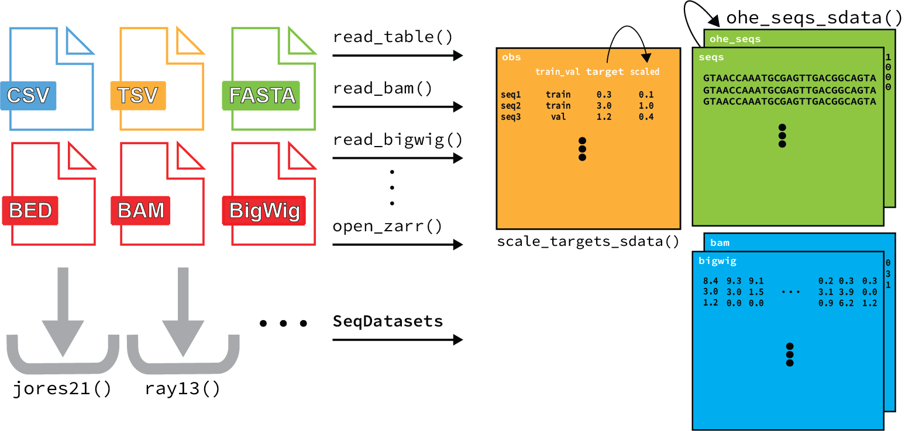
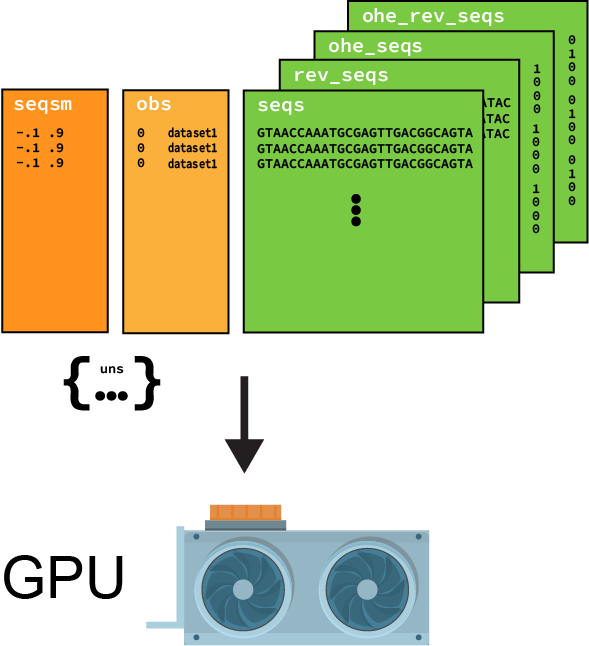
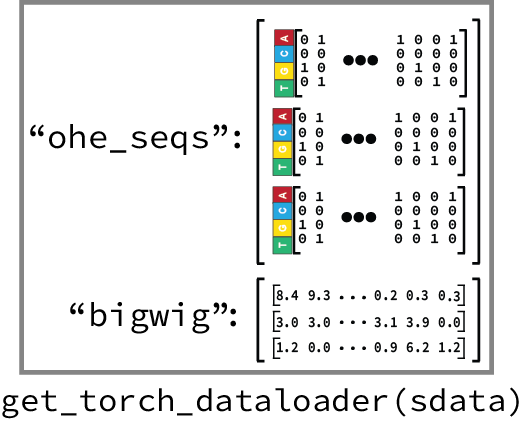
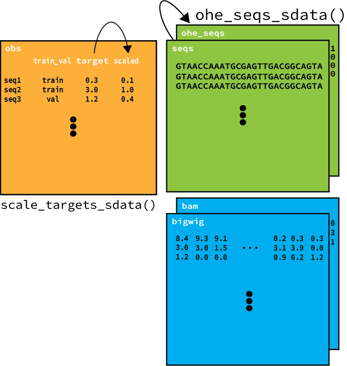
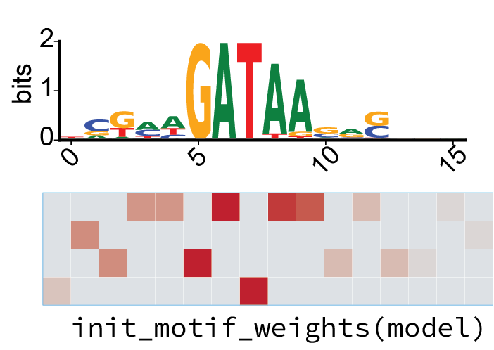
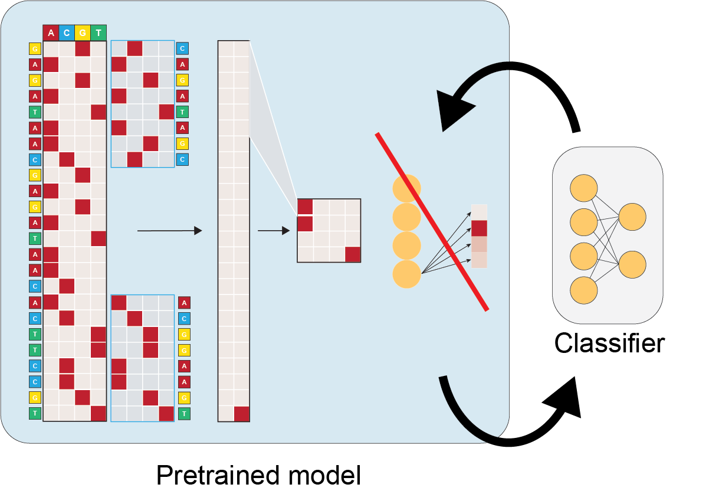
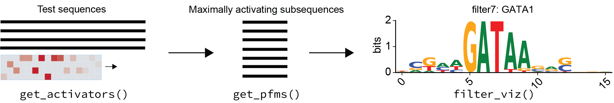
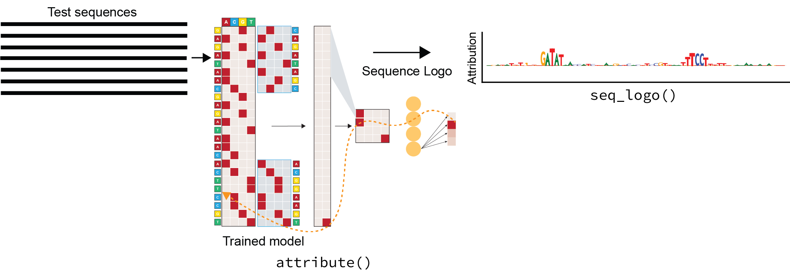
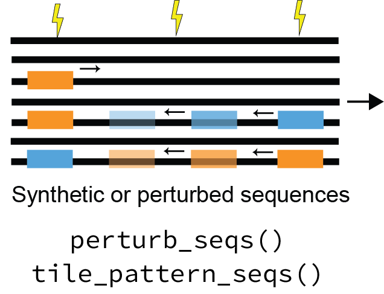

# EUGENe Usage Principles
This page dives into the details of EUGENe and it's subpackages. It includes links to tutorials, resources, and relevant documentation.

## Extract, transform, and load

### `SeqData` -- The core data manager for EUGENe
[SeqData](https://github.com/ML4GLand/SeqData) is our standalone data-handling package built into EUGENe. It efficiently loads data from a variety of file types and allows users to create common and custom datasets.



#### 1. Composing a dataset from genomics file types
`SeqData` includes several reader classes that are designed to efficiently load data from CSV/TSV (tabular), FASTA, BED, BAM, and BigWig files. These readers can be combined using SeqData's `from_flat_files` and `from_region_files` to create many commonly used datasets. Here's a quick example of how you can use `SeqData` to create a dataset from a reference FASTA, peaks in a BED file and their corresponding coverage values in a BigWig file:

```python
import seqdata as sd
sdata = sd.from_region_files(
    sd.GenomeFASTA(
        'seq',
        fasta_file,
        batch_size=2048,
        n_threads=4,
    ),
    sd.BigWig(
        'cov',
        bigwig_files,
        sample_names,
        batch_size=2048,
        n_jobs=4,
        threads_per_job=2,
    ),
    path=out_file,
    fixed_length=1000,
    bed=peaks_file,
    overwrite=True,
    max_jitter=128
)
```

There are many other ways to use `SeqData` to create datasets, including using default `read` functions for many common cases.

#### 2. XArray and Zarr
`SeqData` defaults to pulling files from on-disk and loading them as [XArray datasets](https://xarray.dev/), all backed up by [Zarr stores](https://zarr.readthedocs.io/en/stable/). These datasets are scalable, excellent at handling high-dimensional data, and have a proven track record in bioinformatics. We will be adding more information on how to use XArray and Zarr in the future, but for now, check out the [XArray documentation](https://docs.xarray.dev/en/stable/) and the [Zarr documentation](https://zarr.readthedocs.io/en/stable/).

#### 3. Out-of-core data loading
Zarr stores can be loaded "out-of-core," thanks to functionality form XArray and [Dask](https://www.dask.org/). This allows you to process and train on datasets that would otherwise not fit into memory. The default behavior of the readers in SeqData is to read data out-of-core, but you can also use the `load()` [function](https://docs.xarray.dev/en/stable/generated/xarray.Dataset.load.html) to load your data into memory at any time. EUGENe also by default loads data into GPU memory in batches (provided a GPU is available) as this is the best practice for training neural networks.



#### 4. Generalizable dataloaders
 The `to_torch_dataloader()` function provided by `SeqData` let's you flexibly build dataloaders that are compatible with your model. We often need this when working with LightningModules from PyTorch Lightning, that may be expecting batches of data in a specific format. The `to_torch_dataloader()` function is designed to be flexible and can be used to create dataloaders that are compatible with many different architectures. For example, this is how we would create a dataloader for our [SequenceModule](https://eugene-tools.readthedocs.io/en/latest/api/classes/eugene.models.SequenceModule.html#eugene.models.SequenceModule):

 ```python
 transforms = {
    "ohe_seq": lambda x: x.swapaxes(1, 2)
}

dl = sd.get_torch_dataloader(
    sdata,
    sample_dims='_sequence',
    variables=['ohe_seq', 'bigwig'],
    transforms=transforms,
    batch_size=1024,
    pin_memory=True,
    drop_last=False,
)
```



#### 5. Resource management
It's important to strike a balance between the resources you have and the size of your dataset when deciding whether to load your data into CPU memory before training. If you're dealing with large datasets (e.g. Mbs of DNA sequence), you might find you need to use out-of-core training. However, we've found that many large datasets can fit entirely into memory on machines with less than 32GB of RAM. In most use cases, loading into memory is not prohibitive.

### `SeqDatasets` -- Access to common datasets
Every bioinformatician knows the pain of trying to track down and format a dataset for their needs. [SeqDatasets](https://github.com/ML4GLand/SeqDatasets) provides a growing list of preprocessed datasets so users can quickly benchmark methods and rapidly prototype models.

#### 1. Listing available datasets
A file containing a list of datasets and their descriptions is kept in `datasets.csv` that can be accessed with the `seqdatasets.get_dataset_info()` function.

#### 2. Datasets are easy to access and are returned in a standard format
Datasets are returned to users as `SeqData` objects with simple calls (e.g. `seqdatasets.deAlmeida()`). If the user does not have the dataset downloaded in the location specified by the command, EUGENe works to download it for you.

#### 3. Datasets can be added by the community
Adding datasets is a straightforward process. We will be developing a tutorial notebook soon that walks you through the process of adding a dataset to SeqDatasets. We strongly encourage users to do so and submit pull requests for them so that others can benefit from your work.

### `preprocess` -- prepare data for model training
In EUGENe, we have developed a set of preprocessing functions that are designed to be used with `SeqData` objects. We outline the three main categories of preprocessing functions below.



#### 1. Sequence manipulation is handled efficiently by SeqPro
We developed the standalone package [SeqPro](https://github.com/ML4GLand/SeqPro) for efficent sequence preprocessing. SeqPro offers Numba-accelerated padding and one-hot encoding of sequences, jittering and k-mer frequency preserving shuffling, and more! You can find more information on how to use these features in SeqPro's documentation here.

#### 2. EUGENe helps users with train-test splits
Splitting your dataset into training and testing sets is a key step in machine learning. EUGENe provides a variety of methods to perform this task. For instance, you can choose to split your data by chromosome, fraction, on homology. Check out the [tutorial]() on train-test split functions to learn more about how to use these features.

#### 3. Target normalization
You can perform normalization of training targets directly on XArray datasets, often without loading data into memory. EUGENe currently offers built-in preprocessing steps like binning, z-scoring, and clamping, but we will be adding more in the future.

## Instantiate, initialize, and train

### `models` -- instantiate and initialize neural network architectures
This module is designed to help users instantiate and initialize network architectures.

#### 1. EUGENe's neural network library has an intuitive hierarchy for model architecting
In EUGENe, we've developed a comprehensive library of neural network layers for regulatory genomics. Building upon PyTorch, we've added several useful layers such as inception and residual layers, and also implemented flexible functions to create common ["blocks"](https://eugene-tools.readthedocs.io/en/latest/api.html#blocks) and ["towers"](https://eugene-tools.readthedocs.io/en/latest/api.html#towers) that are composed of diverse sets of layers arranged in a predefined or adaptable order. 

```python
from eugene.models import Conv1DBlock
conv1d_block = blocks.Conv1DBlock(
    input_len=100,
    input_channels=4,
    output_channels=32,
    conv_kernel=23,
    conv_type="conv1d",
    conv_padding="same",
    pool_type="max",
    norm_type="batchnorm",
    dropout_rate=0.5,
    order="conv-act-pool-dropout"
)
```

Take the above as an example. Here a convolutional block (`Conv1DBlock` in EUGENe) often comprises convolutional, normalization, activation, and dropout layers in different orderings depending on the model and task. The above instantiated convolutional block has an ordering based on the [DeepSEA](https://www.nature.com/articles/nmeth.3547) architecture.

#### 2. EUGENe offers a variety of built-in models that cover many common use cases
With EUGENe, you have access to customizable fully connected (FCN), convolutional (CNN), recurrent (RNN), and hybrid architectures. These can be instantiated from single function calls:

```python
model = CNN(
    input_len=100,
    output_dim=10,
    conv_kwargs={
        "input_channels": 4,
        "conv_channels": [10, 10],
        "conv_kernels": [5, 3],
        "activations": [],
        "pool_types": []
    }
)
```

or from configuration files:

```python
from eugene import models
model = models.load_config("cnn.yaml")
```

The configuration files are written in YAML format and are designed to be human-readable and easy to edit. They run through the same API as the single function calls, so you can easily switch between the two. Here's an example of a configuration file (`cnn.yaml`) that would instantiate the same model as the function call above:

```yaml
model:
  name: CNN
  input_len: 100
  output_dim: 10
  conv_kwargs:
    input_channels: 4
    conv_channels: [10, 10]
    conv_kernels: [5, 3]
    activations: []
    pool_types: []
```

#### 3. EUGENe offers many published architectures you can train yourself
We've also recreated several published architectures accessible through single function calls. These architectures are flexible, so you can experiment with different hyperparameters and configurations. Here's an example of how you can instantiate a DeepSTARR model with exponential activations:

```python
from eugene.models import zoo
model = zoo.DeepSTARR(
    input_len=249,
    output_dim=2,
    activations="exp",
)
```

Users looking to use their own custom architectures can also do so. EUGENe only requires that an architecture be defined by its layers and how inputs are propagated through those layers.

```python
import torch.nn as nn
import torch.nn.functional as F
class SmallCNN(nn.Module):
    def __init__(self):  # define layers
        super(SmallCNN, self).__init__()

        # Set the attributes
        self.input_len = 100
        self.output_dim = 1

        # Create the blocks
        self.conv1 = nn.Conv1d(4, 30, 21)
        self.relu  = nn.ReLU()

        self.dense = nn.Linear(30, 1)

    def forward(self, x):  # define how inputs are propagated through those layers
        x = self.conv1(x)
        x = self.relu(x)
        x = F.max_pool1d(x, x.size()[-1]).flatten(1, -1)
        x = self.dense(x)
        return x
```
For more information on EUGENe's NN library and on model instantiation, check out the [model instantiation tutorial](https://github.com/ML4GLand/tutorials/blob/main/eugene/models/instantiating_models.ipynb).

#### 4. Initializing models is easy with EUGENe's model building functions
After defining a model architecture, EUGENe provides you with the tools to initialize it. The model parameters can be sampled from standard initialization distributions,

```python
from eugene import models
models.init_weights(model, initializer="xavier_uniform")
```

or in the case of convolutional filters, initialized with known motifs:

```python
from eugene import models
models.init_motif_weights(
    model,
    layer_name="conv1",
    motifs=motifs  # a motifdata object
)
```



### `train` -- fit parameters to your data
Once initialized, EUGENe can be used to fit the architectures to datasets, with options to perform hyperparameter optimization. This module is mainly a wrapper around [PyTorch Lightning's trainers](https://pytorch-lightning.readthedocs.io/en/stable/common/trainer.html) with defaults that will cover many use cases.

#### 1. Leverage the power of PyTorch Lightning
EUGENe's leverages the power of PyTorch Lightning's training features, including multi-GPU training, gradient accumulation, and more. You don't need to know much about PyTorch Lightning to work with EUGENe, but if interested, check out the [PyTorch Lightning documentation](https://pytorch-lightning.readthedocs.io/en/stable/common/trainer.html) for more information.

#### 2. Wrap your model in the right LightningModule
Each EUGENe LightningModule delineates the architecture types it can train and standardizes boilerplate tasks for those architectures. For instance, the primary LightningModule in EUGENe, called [SequenceModule](https://eugene-tools.readthedocs.io/en/latest/api/classes/eugene.models.SequenceModule.html#eugene.models.SequenceModule), is set up to train an architecture that takes in a single tensor (typically one-hot encoded DNA sequences) and delivers a single tensor output. We can wrap any architecture that meets these criteria in a SequenceModule and train it with EUGENe's training module:

```python
from eugene import models
models.SequenceModule(
    arch=SmallCNN(),
    task="binary_classification",
    loss_fxn="bce",
    optimizer="adam",
    metric="auroc"
)
```

Using LightningModules in this manner allows for the versatile reuse of the same architectures in different training schemes and tasks, and for the fine-tuning of pretrained models. We anticipate the development of a library of LightningModules for different training schemes, including adversarial learning, generative modeling, language modeling, and more.

#### 3. Choose the right fit function for your LightningModule
LightningModules in EUGENe are trained using the `fit` function. In EUGENe we provide a generic `fit` function that expects PyTorch dataloaders passed in. This allows users to generate their own dataloader that may fit their own custom LightningModule. However, we also provide several fit functions that are designed to work with specific LightningModules built into EUGENe. For instance, the `fit_sequence_module` function is designed to work with the `SequenceModule` and expects a `SeqData` object as input. This function will automatically generate the training and validation dataloaders for the SequenceModule and train it.

```python
from eugene import train
train.fit_sequence_module(
    model,
    sdata,
    seq_var_="ohe_seq",
    target_var_s=['target'],
    in_memory=True,
    train_var_="train_val",
    epochs=25,
    batch_size=1024,
    drop_last=False,
    early_stopping_metric=None,
    model_checkpoint_monitor=None,
    transforms=transforms
)
```

#### 4. Hyperparameter optimization with RayTune
We support performing hyperparameter sweeps with RayTune on any EUGENe LightningModule. Though still under active development, we provide a tutorial on how to use RayTune with EUGENe [here](https://github.com/ML4GLand/tutorials/blob/main/eugene/train/hyperparameter_optimization.ipynb).

#### 5. Fine-tuning



Fine-tuning is also possible with EUGENe. Users can instantiate a new architecture that includes the pretrained model in the __init__ method

You can peel layers off layers of the pretrained model to get at the feature extractors using something like:

```python
layers = list(pretrained.children())[:-1]
```

<todo image>

The weights of the pretrained trunk can then be fixed by using the `torch.no_grad` context manager, and the other layers fine-tuned with the regular EUGENe fit or hyperoptimization functions.

```python   
class CustomTransferArch(nn.Module):
  
  def __init__(PATH)
  super(CustomTransferArch, self).__init__()
    self.feature_extractor = load_from_checkpoint(PATH)
    self.linear = nn.Linear

  def forward(self, x, x_rev):
    self.feature_extractor.eval()
    with torch.no_grad():
        x = self.feature_extractor(x)
    x = x.view(x.shape[0], -1)
	x = self.linear(x)
	return x
```

Keep an eye out for a tutorial on this coming soon!

## Evaluate and Interpret (EI)

### `evaluate` -- validate and explore models on new data

#### 1. Prediction functions follow the same API as the fit functions
Similarly to training, this module is mainly a wrapper around [PyTorch Lightning's trainers](https://pytorch-lightning.readthedocs.io/en/stable/common/trainer.html). These allow for EUGENe to take advantage of PyTorch Lightning for efficient inference.

```python
from eugene import evaluate
evaluate.predict_sequence_module(
    model,
    sdata,
    seq_var_="ohe_seq",
    target_var_s=['target'],
    in_memory=True,
    batch_size=1024,
    drop_last=False,
    transforms=transforms
)
```

#### 2. EUGENe's metrics library under active development
We have also have begun a metrics library to help users calculate performance metrics on their `SeqData` objects (more details coming soon!).

### `SeqExplainer` -- investigate learned model behavior
[SeqExplainer](https://github.com/ML4GLand/SeqExplainer) is our standalone package for intepreting models. We wrapped it into EUGENe to make it easier to use with `SeqData` objects.

#### 1. Interpret the filters in your first convolutional layer


EUGENe provides a wrapper around the `SeqExplainer` methods for interpreting the filters in your first convolutional layer. 

```python
generate_pfms_sdata(
    model,
    sdata,
    seq_var = "ohe_seq",
    layer_name = "conv1",
)
```

You can find a detailed tutorial on how to use these methods and interpret their results [here](https://github.com/ML4GLand/tutorials/blob/main/seqexplainer/filter_interpretation.ipynb).

#### 2. Calculate per nucleotide attributions


EUGENe provides a wrapper around the `SeqExplainer` methods for calculating per nucleotide attributions:

```python
def attribute_sdata(
    model,
    sdata,
)
```

You can find a detailed tutorial on how to use these methods and interpret their results [here](https://github.com/ML4GLand/tutorials/blob/main/seqexplainer/attribution_analysis.ipynb).

#### 3. Global importance analysis


To get at the quantitative effects of such patterns, `SeqExplainer` offers a wide range of functionality for conducting *in silico* experiments with motifs of interest, also known as global importance analyses or GIAs, using the trained model as an oracle (dedicated tutorial coming soon). EUGENe currently provides wrappers for streamlining an analysis of a motif's positional importance and a distance-dependent motif cooperativity analysis.

#### 4. Guided sequence generation
The last class of interpretability methods currently offered in `SeqExplainer` uses trained models to guide sequence evolution. We implemented the simplest form of this approach that iteratively evolves a sequence by greedily inserting the mutation with the largest predicted impact at each iteration. Starting with an initial sequence (e.g. random, shuffled, etc.), this strategy can be used to evolve synthetic functional sequences:

```python
def evolve_sdata(
    model,
    sdata
)
```

You can find a detailed tutorial on how to use these methods and interpret their results [here](https://github.com/ML4GLand/tutorials/blob/main/seqexplainer/sequence_evolution.ipynb).

### `plot` -- Visualize it all as you go
This module is designed to help users visualize their data and results from a workflow. We have included several plotting functions that are designed to work with `SeqData` objects and can be broken up into several different categories.

#### 1. [Categorical plotting](https://eugene-tools.readthedocs.io/en/latest/api.html#categorical-plotting)
These functions can be used for exploratory data analysis (EDA)

#### 2. [Training summary](https://eugene-tools.readthedocs.io/en/latest/api.html#training-summaries)
These functions are designed to help users visualize the training process

#### 3. [Performance plotting](https://eugene-tools.readthedocs.io/en/latest/api.html#performance)
These functions are designed to help users visualize the performance of their models data in a `SeqData` object.

#### 4. [Sequence plotting](https://eugene-tools.readthedocs.io/en/latest/api.html#sequences)
These functions are designed to help users visualize the sequences in their `SeqData` objects and any annotations that are present for those sequences.
