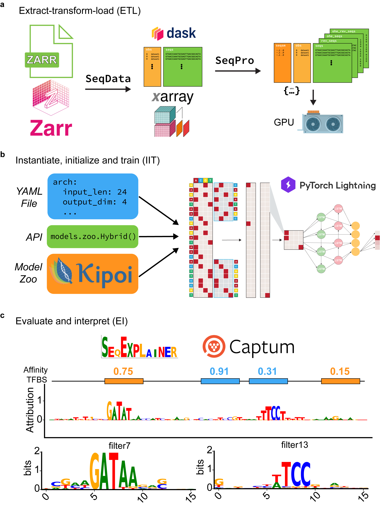

# EUGENe Usage Principles
Welcome to the practical guide for EUGENe. Here, you'll find details on how to make EUGENe work for you, along with links to tutorials, resources, and documentation. Let's start by understanding the typical EUGENe workflow, as shown below:



## Extract, transform, and load

### `SeqData` -- The core data manager for EUGENe
SeqData is our standalone data-handling package that is built-in to EUGENe. It efficiently loads data from a variety of file types and allows you to create common and custom datasets. We outline some SeqData principles below, but check out the SeqData API for a deep dive.

#### 1. Loading data made easy
SeqData's reader objects are designed to load data from CSV/TSV (tabular), FASTA, BED, BAM, and BigWig files swiftly, efficiently, and in parallel. Here's a quick example of how you can use SeqData to create a dataset with sequences and their corresponding BigWig coverage values:

```python
import seqdata as sd
sdata = sd.from_region_files(
    sd.GenomeFASTA(
        'seq',
        fasta_file,
        batch_size=2048,
        n_threads=4,
    ),
    sd.BigWig(
        'cov',
        bigwig_files,
        sample_names,
        batch_size=2048,
        n_jobs=4,
        threads_per_job=2,
    ),
    path=out,
    fixed_length=2114,
    bed=peaks,
    overwrite=True,
    max_jitter=128
)
```

#### 2. XArray and Zarr
SeqData defaults to pulling files from your disk and loading them as XArray datasets, all backed up by Zarr stores. They're scalable, excellent at handling high-dimensional data, and have a proven track record. 

#### 3. Out-of-core data loading
Zarr stores can be loaded "out-of-core," thanks to XArray and Dask. This allows you to process and train with massive datasets without loading everything into memory at once.

#### 4. Training in EUGENe
EUGENe always loads data into GPU memory in batches (provided a GPU is available), However, using the out-of-core functionality can slow down the process on the CPU. `to_torch_dataloader()` is a function that allows you to load your data into PyTorch dataloaders, which can be used to train your model. You can find more information on how to use this function in the SeqData API.

#### 5. Resource management
It's important to strike a balance between the resources you have and the size of your dataset when deciding whether to load your data into CPU memory before training. If you're dealing with large datasets, you might find the out-of-core feature handy. Don't fret about memory; many large datasets can fit entirely into memory on machines with less than 32GB of RAM. Check out Supplementary Table 2 for examples.

### `SeqDatasets` -- Quickly start your development or benchmarking
Every bioinformatician knows the pain of trying to track down and format a dataset for their needs. SeqDatasets is meant to ease that burden. It sets up users to quickly benchmark methods and rapidly prototype models on a variety of datasets. We outline some SeqDatasets principles below, but check out the SeqDatasets API for a deep dive.

#### 1. A dataset for every need
A file containing a list of datasets and their descriptions is kept in `datasets.csv` that can be accessed with the `seqdatasets.get_dataset_info()` function.

#### 2. Datasets are easy to access and in a standard format
Datasets are returned to users as `SeqData` objects with simple calls (e.g. seqdatasets.dataset_name()). If the user does not have the dataset downloaded in the location specified by the command, EUGENe works to download it for you.

#### 3. Datasets can be added by the community
Adding datasets is a straightforward process! We have developed a tutorial notebook that walks you through the process of adding a dataset to SeqDatasets. You can find it [here](https://github.com/cartercompbio/EUGENe/blob/main/tutorials/adding_a_dataset_tutorial.ipynb). We strongly encourage users to do so and submit pull requests for them.

### `preprocess` -- prepare data for model training
In EUGENe, we have developed a set of preprocessing functions that are designed to be used with `SeqData` objects.

#### 1. Sequence manipulation is handled efficiently by SeqPro
We developed the standalone package `SeqPro` that is dedicated to efficenty sequence preprocessing. SeqPro employs Numba-accelerated padding and one-hot encoding, enabling efficient manipulation of DNA and RNA sequences. Additionally, it supports jittering and k-mer frequency preserving shuffling, further enhancing the versatility of your sequence processing pipeline. You can find more information on how to use these features in SeqPro's documentation here.

#### 2. EUGENe helps users with train-test splits
Splitting your dataset into training and testing sets is a key step in machine learning. EUGENe provides a variety of methods to perform this task. For instance, you can choose to split your data by chromosome or fraction, or based on homology. Each method caters to different types of research requirements, allowing you to select the most suitable one for your project. Check out the tutorial on train-test split functions to learn more about how to use these features.

#### 3. Target normalization can be done out-of-core
When working with large datasets, it's often not feasible to load all your data into memory at once. EUGENe addresses this by supporting out-of-core target normalization. You can perform preprocessing steps like binning, z-scoring, and clamping directly on your XArray datasets, without having to load the entire dataset into memory. This feature enables you to work efficiently with large datasets, maximizing the use of your computational resources. For more information on how to use out-of-core target normalization, refer to the guide here.

## Instantiate, initialize, and train

### `models` -- instantiate and initialize neural network architectures
EUGENe's models module is designed to help users instantiate, initialize, and train neural network architectures. 

#### 1. EUGENe's neural network library has an intuitive hierarchy for model architecting
In EUGENe, we've developed a comprehensive library of neural network layers for regulatory genomics, building upon the foundation laid by PyTorch. We've added several useful layers such as inception and residual layers, enhancing the flexibility and options available for designing neural networks. We've also introduced flexible functions to create common "blocks" and "towers" that are composed of diverse sets of layers arranged in a predefined or adaptable order. For example, a convolutional block (Conv1DBlock in EUGENe) often comprises convolutional, normalization, activation, and dropout layers in different orderings depending on the model and task.

#### 2. EUGENe offers a variety of built-in models that cover many common use cases
With EUGENe, you have access to customizable fully connected (FCN), convolutional (CNN), recurrent (RNN), and hybrid architectures. These can be instantiated from single function calls or from configuration files. We've also recreated several published architectures accessible through single function calls. Users looking to use their own custom architectures can easily do so; EUGENe only requires that an architecture be defined by its layers (init function) and how inputs are propagated through those layers (forward function).

#### 3. Initializing models is easy with EUGENe's model building functions
After defining a model architecture, EUGENe provides you with the tools to initialize it. The model parameters can be sampled from standard initialization distributions, or in the case of convolutional filters, initialized with known motifs. Once initialized, EUGENe can be used to fit the architectures to datasets, with options to perform hyperparameter optimization through the RayTune package.

### `train` -- fit parameters to your data
For basic trianing, this module is mainly a wrapper around [PyTorch Lightning's trainers](https://pytorch-lightning.readthedocs.io/en/stable/common/trainer.html) with a few training defaults that will cover most use cases.

#### 1. Leverage the power of PyTorch Lightning

#### 2. Wrap your model in the right LightningModule
For the training phase, EUGENe employs PyTorch Lightning's (PL) LightningModules. Each EUGENe LightningModule delineates the architecture types it can train and standardizes boilerplate tasks for those architectures. For instance, the primary LightningModule in EUGENe, termed SequenceModule, is set up to train an architecture that takes in a single tensor (typically one-hot encoded DNA sequences) and delivers a single tensor output. Using LightningModules in this manner allows for the versatile reuse of the same architectures in different training schemes and tasks, and for the fine-tuning of pretrained models. We anticipate the development of a library of LightningModules for different training schemes, including adversarial learning, generative modeling, language modeling, and more.

#### 3. Choose the right fit function for your LightningModule

## Evaluate and Interpret (EI)

### `evaluate` -- validate and explore models on new data
Similarly to training, this module is mainly a wrapper around [PyTorch Lightning's trainers](https://pytorch-lightning.readthedocs.io/en/stable/common/trainer.html). However, we have also have begun a metrics library to help users calculate training metrics on their `SeqData` objects (more details coming soon!).

#### 1. Prediction functions follow the same API as the fit functions

#### 2. EUGENe's metrics library is developing

### `interpret` -- investigate learned model behavior
This module is designed to help users interpret their models. We have included several interpretability functions that are designed to work with `SeqData` objects and can be broken up into several different categories.

#### 1. Interpret the filters in your first convolutional layer

#### 2. Calculate per nucleotide attributions

#### 3. Global importance analysis

#### 4. Guided sequence generation

### `plot` -- Visualize it all as you go
This module is designed to help users visualize their data and results from a workflow. We have included several plotting functions that are designed to work with `SeqData` objects and can be broken up into several different categories.

#### 1. [Categorical plotting](https://eugene-tools.readthedocs.io/en/latest/api.html#categorical-plotting) functions can be used for exploratory data analysis (EDA) and are designed to work with information in the `seqs_annot` attribute of `SeqData` objects.

#### 2. [Training summary](https://eugene-tools.readthedocs.io/en/latest/api.html#training-summaries) functions are designed to help users visualize the training process and act on Tensorboard events files.

#### 3. [Performance plotting](https://eugene-tools.readthedocs.io/en/latest/api.html#performance) functions are designed to help users visualize the performance of their models data in a `SeqData` object. 

#### 4. [Sequence plotting](https://eugene-tools.readthedocs.io/en/latest/api.html#sequences) functions are designed to help users visualize the sequences in their `SeqData` objects and any annotations that are present for those sequences. These annotations might include feature attributions, predicted TF binding sites, or other information.
